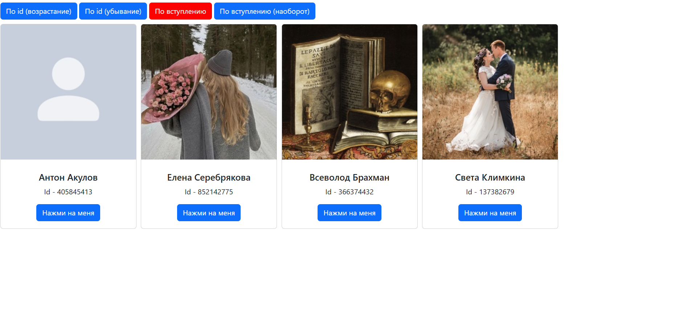
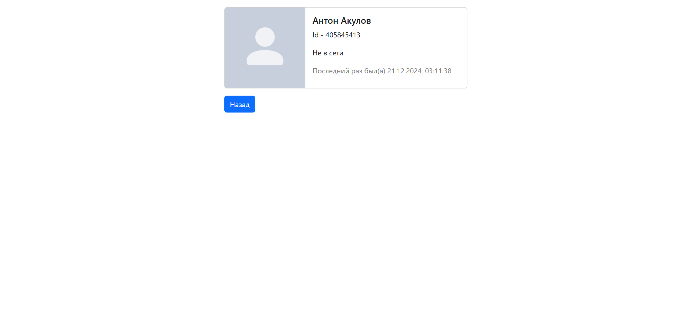

# основное задание:
создать двухстраничное приложение из примера по вариантам. вариант состоит из 2 методов и доп фильтра на эти методы.

**1 вариант**  

главная страница - [groups.getMembers](https://dev.vk.com/ru/method/groups.getMembers). получаем список пользователей группы и отображаем их. необходимо сделать компонент для фильтра sort (см. groups.getMembers -> Параметры -> sort).

вторая страница - [users.get](https://dev.vk.com/ru/method/users.get). отображаем выбранного пользователя на первой странице.

# дополнительное задание:
переписать все XHR-запросы на axios

# код лабараторной работы:
## index.html
```HTML
<!DOCTYPE html>
<html lang="en">
<head>
    <meta charset="UTF-8">
    <title>Simple App</title>
    <link rel="stylesheet" href="node_modules/bootstrap/dist/css/bootstrap.min.css">
    <style>
        .center {
            display: grid;
            place-items: center;
            margin-top: 10px;
        }

        .d-flex {
            gap: 10px;
        }
        #root {
            padding: 10px;
        }
    </style>
    <script src="https://cdn.jsdelivr.net/npm/axios/dist/axios.min.js"></script>
</head>
<body>
<div id="root"></div>
<script src="main.js" type="module"></script>

<script src="node_modules/bootstrap/dist/js/bootstrap.bundle.min.js"></script>
</body>
</html>
```
## main.js
```JavaScript
import {MainPage} from "./pages/main/index.js";


const root = document.getElementById('root');

const mainPage = new MainPage(root, 3)
mainPage.render();
```

## ./pages/main/index.js
```JavaScript
import {ProductCardComponent} from "../../components/product-card/index.js";
import {ProductPage} from "../product/index.js";
import { ButtonInfo } from "../../components/button-info/index.js";

import {ajax} from "../../modules/ajax.js";
import { urls } from "../../modules/aaa.js";
import {groupId} from "../../modules/consts.js";

export class MainPage {
    constructor(parent, flag) {
        this.parent = parent;
        this.flag = flag
    }

    get pageRoot() {
        return document.getElementById('main-page')
    }
    
    getHTML() {
        return (
            `
                <div id="main-page" class="d-flex flex-wrap"></div>
            `
        )
    }

    getData() {
        ajax.post(urls.getGroupMembers(groupId, this.flag), (data) => {
            this.renderData(data.response.items)
        })
    }

    renderData(items) {
        const buttoninfo = new ButtonInfo(document.getElementById("buttons"), this.flag) 
        buttoninfo.render()
        items.forEach((item) => {
            const productCard = new ProductCardComponent(this.pageRoot)
            productCard.render(item, this.clickCard.bind(this))
        })
    }

    clickCard(e) {
        const cardId = e.target.dataset.id
        const productPage = new ProductPage(this.parent, cardId, this.flag)
        productPage.render()
    }
    
    render() {
        this.parent.innerHTML = ''
        const html = this.getHTML()
        this.parent.insertAdjacentHTML('beforeend', '<div id="buttons" style="margin-bottom: 10px;"></div>')
        this.parent.insertAdjacentHTML('beforeend', html)
        this.getData()
    }
}
```
## ./pages/product/index.js
```JavaScript
import {ProductComponent} from "../../components/product/index.js";
import {BackButtonComponent} from "../../components/back-button/index.js";
import {MainPage} from "../main/index.js";


import {ajax} from "../../modules/ajax.js";

import { urls } from "../../modules/aaa.js";


export class ProductPage {
    constructor(parent, id, flag) {
        this.parent = parent
        this.id = id
        this.flag = flag
    }

    getData() {
        ajax.post(urls.getUserInfo(this.id), (data) => {
            this.renderData(data.response)
        })
    }

    get pageRoot() {
        return document.getElementById('product-page')
    }

    getHTML() {
        return (
            `   <div class="center">
                    <div id="product-page"></div>
                </div>
            `
        )
    }

    clickBack() {
        const mainPage = new MainPage(this.parent, this.flag)
        mainPage.render()
    }

    renderData(item) {
        const product = new ProductComponent(this.pageRoot)
        product.render(item[0])
        const backButton = new BackButtonComponent(this.pageRoot)
        backButton.render(this.clickBack.bind(this))
    }

    render() {
        this.parent.innerHTML = ''
        const html = this.getHTML()
        this.parent.insertAdjacentHTML('beforeend', html)
        
        this.getData()

    }
}
```
## ./modules/aaa.js
```JavaScript
import {accessToken, version} from "./consts.js";

class Urls {
    constructor() {
        this.url = 'https://api.vk.com/method'
        this.commonInfo = `access_token=${accessToken}&v=${version}`
    }

    getUserInfo(userId) {
        return `${this.url}/users.get?user_ids=${userId}&fields=photo_400_orig,online,last_seen&${this.commonInfo}`
    }

    getGroupMembers(groupId, flag) {
        if (flag == 1) return `${this.url}/groups.getMembers?group_id=${groupId}&sort=id_asc&fields=photo_400_orig&${this.commonInfo}`
        if (flag == 2) return `${this.url}/groups.getMembers?group_id=${groupId}&sort=id_desc&fields=photo_400_orig&${this.commonInfo}`
        if (flag == 3) return `${this.url}/groups.getMembers?group_id=${groupId}&sort=time_asc&fields=photo_400_orig&${this.commonInfo}`
        if (flag == 4) return `${this.url}/groups.getMembers?group_id=${groupId}&sort=time_desc&fields=photo_400_orig&${this.commonInfo}`
        
    }   
}

export const urls = new Urls()
```
## ./modules/ajax.js
```JavaScript
/* class Ajax {

    post(url, callback) {
        let xhr = new XMLHttpRequest()
        xhr.open('POST', url)
        xhr.send()

        xhr.onreadystatechange = () => {
            if (xhr.readyState === 4) {
                const data = JSON.parse(xhr.response)
                callback(data)
            }
        }
    } 

    post(url, callback) {
        axios.post(url)
            .then(response => {
                callback(response.data);
            })
            .catch(error => {
                console.error('Ошибка:', error);
                callback(null);
            });
    } 
   
    async post(url, callback) {
        try {
            let response = await fetch(url, {
                method: 'POST',
            });

            if (response.ok) {
                let responseData = await response.json();
                callback(responseData);
            } else {
                console.error('Error: ', response.statusText);
            }
            
        } catch (e) {
            console.log(e)
        }
    }
}

export const ajax = new Ajax();
 */

class Ajax {
    async post(url, callback, retries = 2, delay = 1000) {
        let attempt = 0; 

        while (attempt < retries) {
            try {
                const response = await fetch(url, { method: 'POST' });

                if (!response.ok) {
                    throw new Error(`Ошибка: ${response.status}`);
                }

                const data = await response.json();
                callback(data);
                return;

            } catch (error) {
                console.error(`Попытка ${attempt + 1} не удалась. Ошибка:, error`);

                attempt++;

                if (attempt < retries) {

                    await new Promise(resolve => setTimeout(resolve, delay));
                } else {
                    console.error("Все попытки не удались");
                }
            }
        }
    }
}

export const ajax = new Ajax();
```
## ./modules/consts.js
```JavaScript
export const groupId = 228518300
export const accessToken = 'vk1.a.6a3NyZ_PNxNBo2AHx-swKGifSIT8ei24_9MDryRptaob6PdRQZJNf5pJunbzyNTmP4PVQJ7AEhDjN5ObrKsmRK14t07eJhq2aXC2fEfzWWfhm0kHln7C14CSNtE3e0JcO3KcE_ROuHCPN7ygq4ZYLLqFNHxCkarrgF5APNhW1wb75pPByXEufXMwqvrIMUQM02jchZ4wWogAaVHD9_JnKw'
export const version = '5.199'
```
## ./components/back-button/index.js
```JavaScript
export class BackButtonComponent {
    constructor(parent) {
        this.parent = parent;
    }

    addListeners(listener) {
        document
            .getElementById("back-button")
            .addEventListener("click", listener)
    }

    getHTML() {
        return (
            `
                <button id="back-button" class="btn btn-primary" type="button">Назад</button>
            `
        )
    }

    render(listener) {
        const html = this.getHTML()
        this.parent.insertAdjacentHTML('beforeend', html)
        this.addListeners(listener)
    }
}
```
## ./components/button-info/index.js
```JavaScript
import { MainPage } from "../../pages/main/index.js";

export class ButtonInfo {
    constructor(parent, id) {
        this.parent = parent;
        this.id = id
    }

    addListeners() {
        document.querySelectorAll(".myb").forEach((button) => {
                button.addEventListener("click", () => {
                    const mainPage = new MainPage(document.getElementById('root'), button.id)
                    mainPage.render();
                })
            })
    }

    getHTML() {
        return (
            `
                <button id="1" data_id="1" class="btn btn-primary myb" type="button">По id (возрастание)</button>
                <button id="2" data_id="2" class="btn btn-primary myb" type="button">По id (убывание)</button>
                <button id="3" data_id="3" class="btn btn-primary myb" type="button">По вступлению</button>
                <button id="4" data_id="4" class="btn btn-primary myb" type="button">По вступлению (наоборот)</button>
            `
        )
    }

    render() {
        const html = this.getHTML()
        this.parent.insertAdjacentHTML('beforeend', html)
        this.addListeners()
        const new_color = document.getElementById(this.id)
        new_color.style.backgroundColor = 'red';
        new_color.style.borderColor = 'red';

    }
}
```
## ./components/product/index.js
```JavaScript
export class ProductComponent {
    constructor(parent) {
        this.parent = parent
    }

    getHTML(data) {
        return (
            `
                <div class="card mb-3" style="width: 540px;">
                    <div class="row g-0">
                        <div class="col-md-4">
                            
                        </div>
                        <div class="col-md-8">
                            <div class="card-body" id="infopole">
                                <h5 class="card-title">${data.first_name} ${data.last_name}</h5>
                                <p>Id - ${data.id}</p>
                            </div>
                        </div>
                    </div>
                </div>
            `
        )
    }

    online(data) {
        if (data === 0) {
            return `<p>Не в сети</p>`
        }

        else {
            return `<p style="color: green;">В сети</p>`
        }
    }

    lastseen(data) {
        const date = new Date(data * 1000);
        return `<span style="color: gray;">Последний раз был(а) ${date.toLocaleString()}</span>`
    }

    render(data) {
        const html = this.getHTML(data)
        this.parent.insertAdjacentHTML('beforeend', html)
        
        const html_2 = this.online(data.online)
        const new_data = document.getElementById("infopole")
        new_data.insertAdjacentHTML('beforeend', html_2)
        
        if (data.online === 0) {
            const html_3 = this.lastseen(data.last_seen.time)
            new_data.insertAdjacentHTML('beforeend', html_3)
        }
    }
}
```
## ./components/product-card/index.js
```JavaScript
export class ProductCardComponent {
    constructor(parent) {
        this.parent = parent;
    }

    getHTML(data) {
        return (
            `
                <div class="card" style="width: 300px;">
                    
                    <div class="card-body center">
                        <h5 class="card-title">${data.first_name} ${data.last_name}</h5>
                        <p>Id - ${data.id}</p>
                        <button class="btn btn-primary" id="click-card-${data.id}" data-id="${data.id}">Нажми на меня</button>
                    </div>
                </div>
            `
        )
    }

    addListeners(data, listener) {
        document
            .getElementById(`click-card-${data.id}`)
            .addEventListener("click", listener)
    }
    

    render(data, listener) {
        const html = this.getHTML(data)
        this.parent.insertAdjacentHTML('beforeend', html)
        this.addListeners(data, listener)
    }
}
```
